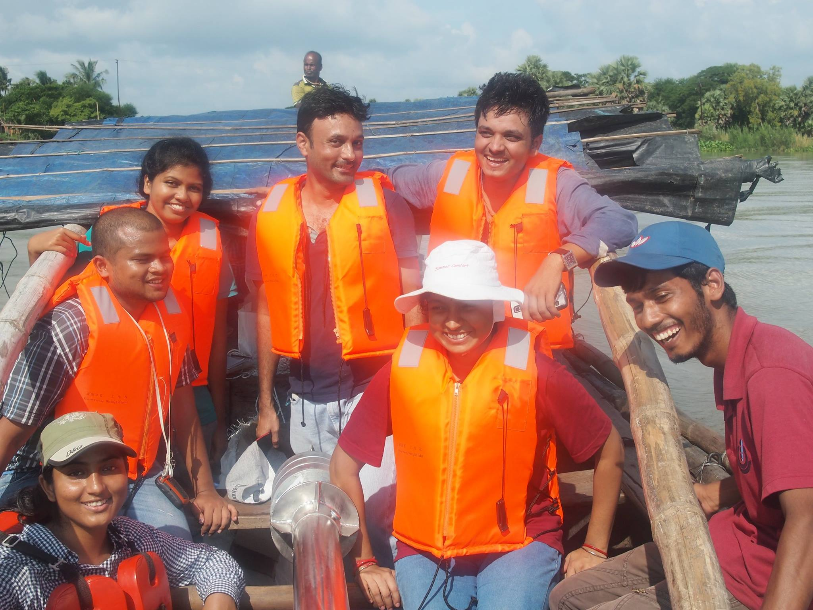

<!-- Load Rubik font from Google -->
<link href="https://fonts.googleapis.com/css2?family=Rubik:wght@400;500;700&display=swap" rel="stylesheet">

<!-- ========================== TRIP 1 ========================== -->

  <h3>1. Gorongosa National Park, Mozambique</h3>
  

    In 2025, I had the extraordinary opportunity to conduct fieldwork in Gorongosa National Park, Mozambique—one of Africa’s most ecologically and geologically rich landscapes. My primary objective was to collect samples for ¹⁰Be dating of Miocene landforms, aiming to constrain the timing of life evolution in this tectonically active region. Working under the mentorship of Prof. René Bobe and Prof. Susana Carvalho—both leading experts in paleoanthropology and evolutionary history—I was part of a multidisciplinary team exploring how landscapes shape life over geological timescales.
  

  

   

   <h4>Chitengo, Apr 2025</h4>
   
   

   

   <h4>Gorongosa National Park, Apr 2025</h4>
   
   

 

<!-- ========================== TRIP 2 ========================== -->

  <h3>2. Ladakh, India</h3>
  

    Between 2018 and 2021, I participated in three field campaigns across Ladakh, each with a distinct scientific focus. The 2018 expedition centered on exposure age dating, where we sampled glacially transported boulders and glacially polished surfaces to reconstruct the timing of glaciation and landscape stabilization. In 2019, our attention shifted to relict lake deposits, which serve as sedimentary records of past hydrological and climatic conditions. The final trip in 2021 allowed us to revisit key sites, refine our sampling strategy, and validate earlier findings. These expeditions, guided by Prof. Navin Juyal, were instrumental in shaping my understanding of high-altitude geomorphic processes and the application of cosmogenic nuclide techniques in extreme environments.
  

 

  <h4>Nubra, Oct 2018</h4>
  
 

 

  <h4>Panamik, Sept 2019</h4>
  
 

<!-- ========================== TRIP 3 ========================== -->

  <h3>3. Uttarakhand, India</h3>
  

    In 2022, I conducted fieldwork in the Himalayan foothills of Uttarakhand, focusing on river sediment sampling to estimate catchment-scale denudation rates. Accompanied by Prof. Navin Juyal and Prof. S. P. Sati, I navigated steep terrain and monsoon-fed rivers to collect sediment samples that would later be analyzed for cosmogenic nuclide concentrations. This work aimed to quantify erosion rates and understand the interplay between tectonics, climate, and surface processes in one of the most dynamic mountain belts on Earth.
  

<!-- ========================== TRIP 4 ========================== -->

  <h3>4. Chilika Lake, Odisha</h3>
  

    In 2016, I conducted two fieldworks at Chilika Lake, Odisha, with Prof. Raj K. Singh and Prof. S. H. Farooq, focusing on surface sediment and sediment core sampling. Our goal was to reconstruct the lake’s recent environmental history through foraminiferal analysis, using microfossil assemblages to infer salinity changes, sediment dynamics, and monsoonal variability. Navigating the lake’s shallow, brackish waters and sampling across ecological gradients, we gathered a dataset that bridges modern processes with paleoenvironmental reconstructions.
  

 

  

   <h4>Chilika, 2016</h4>
   
  

  

   <h4>Chilika, 2016</h4>
   
  

 

