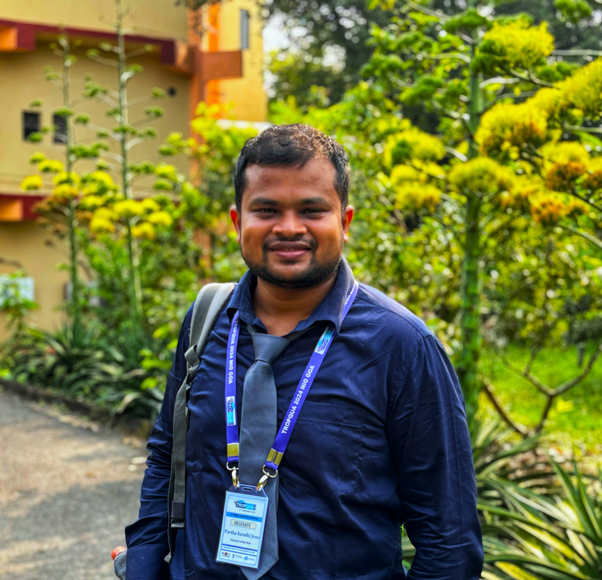

 

Hi, I’m 
 

 <b> PARTHA SARATHI JENA</b>

 

 <b> Researcher 👩🏼‍🎓, Educator 🧑‍🏫, Digital Storyteller 🎥 </b>

      

<h4 style="margin-top: 0; color: #007acc;">📌 About me</h4>

  

    I am a researcher, specializing in (paleo)climate studies, with a focus on geochemical proxies—particularly cosmogenic nuclides—to unravel Earth’s environmental history. My work spans a range of dynamic landscapes and marine systems, including the Indian Himalayas, the northern Indian Ocean, and the equatorial Atlantic Ocean.
    
    Beyond the lab and field, I’m passionate about teaching, programming, and exploring new places. I enjoy translating complex scientific ideas into engaging learning experiences, whether in the classroom or through articles/ videos. When I’m not analyzing isotopes or writing papers, you’ll likely find me on the road—camera in hand—capturing stories from my travels and turning them into cinematic travel videos.
    
    📬 Feel free to reach out if you’d like to discuss research ideas, share insights, or explore potential collaborations.

  

   

  
  
    Built with a heart full of ❤️ and a pinch of
    
  

 
    Thanks for visiting! Drop me a note — even a small message can mean a lot.
  

