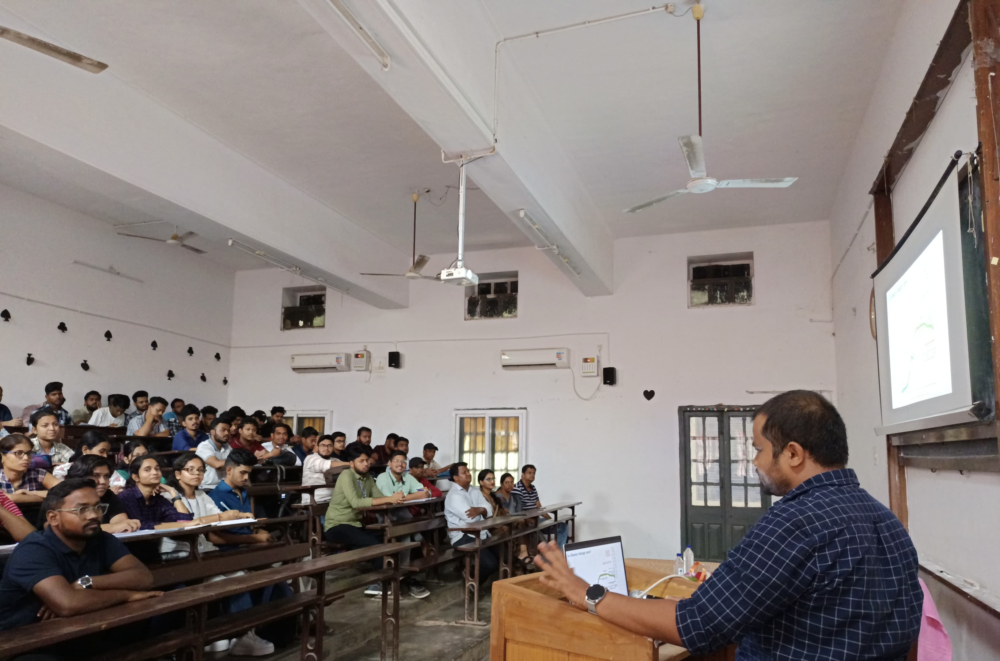
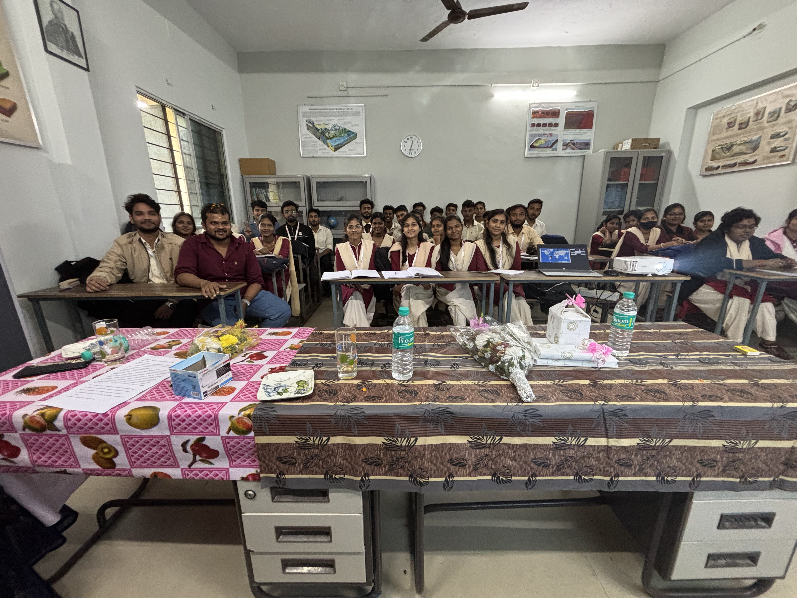
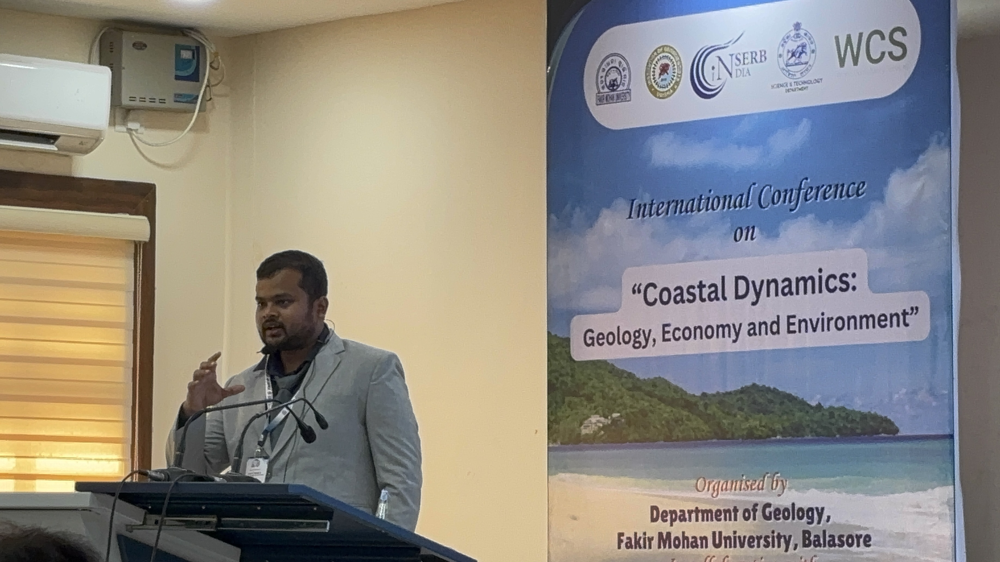
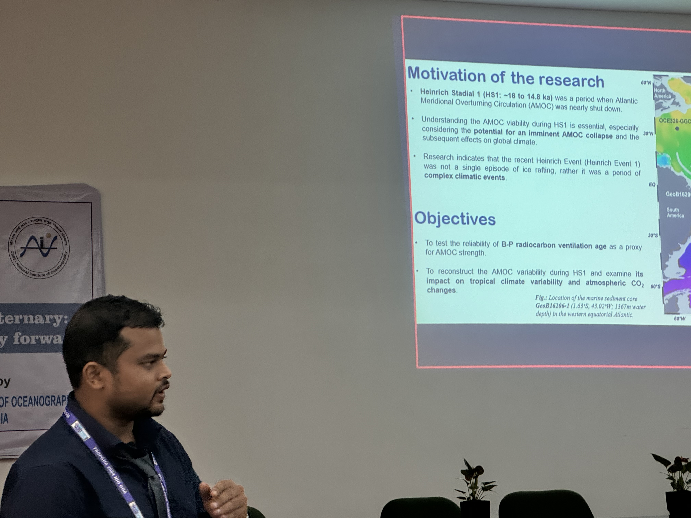

<!-- Floating menu -->

<b>📌 Menu</b> 
<a href="#Invited Talks /Lecture"> Invited talks</a>
<a href="#Presentations at Conferences"> Conference presentation</a>
<a href="#Workshops"> Workshops</a>

## Invited Talks /Lectures 📖

 

  <!-- Image 1 -->
 

  
  
Ravenshaw University

 

  <!-- Image 2 -->
 

  
  
FM Autonomous College

 

Invited talk on “Deglacial evolution in ventilation of the western equatorial Atlantic Ocean and its link to atmospheric CO2 changes” at the Indian Institute of Technology Bhubaneswar on 4th March 2024.

Invited keynote presentation on “Coupling between deep ocean circulation and terrestrial climate change: lessons from the past” at the Fakir Mohan University, Balasore on 9th January 2025. 

Invited extramural lecture on “Decoding Earth’s Climate History: Techniques and Insights” at Fakir Mohan Autonomous College, Balasore on 13th January 2025.

Invited extramural lecture on “Unravelling past climate change through Himalayan Landforms” at Ravenshaw University, Cuttack on 16th April 2025.

Invited extramural lecture on “Glaciers and climate change” at Adikabi Saraladas Degree College, Tirtol on 17th April 2025.

 

## Presentations at Conferences 🧑‍💼

  <!-- FM University -->
 

  
    
🌊 FM University, Jan 2025

 

  <!-- NIO -->
 

  
    
🛰️ NIO, Nov 2024

 

Topic: Deglacial evolution in ventilation of the western equatorial Atlantic Ocean and its link to atmospheric CO2 changes. 
    - TROPQUA-2024
    - Mode: Presentation (Offline/ In-person) on 3rd Nov 2024

Topic: The Atlantic meridional overturning circulation during Heinrich Stadial 1
    - AGU fall meeting-2023
    - Mode: Presentation (Offline/In-person) on 14 Dec 2023

Topic: Past geomagnetic field intensity reconstructed using authigenic 10Be/9Be
    - Frontiers in Geoscience Research Conference (FGRC-23), PRL, Ahmedabad
    - Mode: Presentation (Offline/In-person) on 03 Feb 2023

Topic: 10Be/9Be Ratio Variation in the Central Indian Ocean during the Last 43 ka; Implication to Past Geomagnetic Field Intensity Changes
    - AGU fall meeting-21
    - Mode: Presentation (Online) on 17 Dec 2021

Topic: Spatial variability and residence time of beryllium isotopes in the Indian Ocean: Role of oceanic processes
    - Frontiers in Geoscience Research Conference (FGRC-21), PRL, Ahmedabad
    - Mode: Presentation (Online) on 28 Sept 2021

Topic: Role of In-situ and Meteoric 10Be in Quaternary Glaciation, Marine Chronology, and Paleomagnetic Reconstruction
     - 7th national conference of Ocean Society of India (OSICON-21), NCPOR, Goa
     - Mode: Presentation (Online) on 14 Aug 2021

Topic: “Quaternary Glaciation Studies using terrestrial cosmogenic radionuclides” 
    - Second National Conference and Field Workshop on "Recent Studies on Geology of Kachchh Basin”, KSKV Kachchh University, Gujarat
    - Mode: Poster (Offline/In-person) on 30 Dec 2018

 

## Workshops 🧑‍🏫

Workshop on Paleoclimate data assimilation (Online; 21-23 Aug 2023) organised by Northern Arizona University.

Webinar & Workshop on Proxy System Modeling for Lacustrine Archives (Online; 13 Apr 2023)

Workshop on Isotopes in Earth, Ocean & Atmospheric Sciences organised by the National Institute of Oceanography, Goa

Isocamp2021 organised by the Centre for Stable Isotopes, University of New Mexico (Online)

