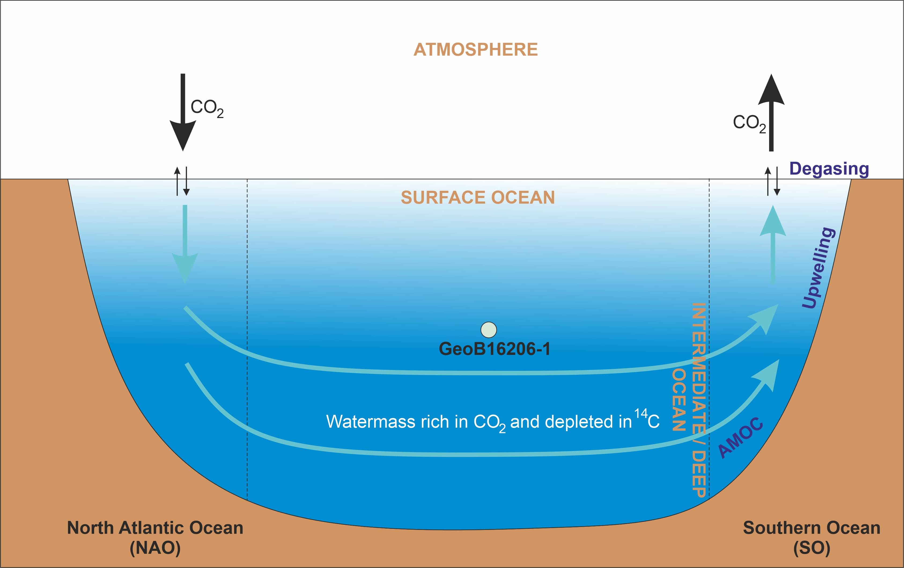

## Primary project

 <b> Abrupt changes in the deep circulation of the western tropical Atlantic Ocean during the last two glacial periods </b>

 <b> Supervisor- </b> Prof. Cristiano M Chiessi, Univeristy of Sao Paulo, Brazil

 <b> Funded by- </b> Sao Paulo Research Foundation (FAPESP)

Understanding how the Atlantic Meridional Overturning Circulation (AMOC) varies on centennial timescales is crucial, as such fluctuations can impact global climate by altering heat transport between hemispheres and influencing how carbon is exchanged between the ocean and atmosphere. However, our knowledge remains limited due to the short span of instrumental data and the lack of high-resolution paleo-records capable of resolving changes at this scale. This project addresses that gap by combining radiocarbon-based ventilation age reconstructions from a uniquely high-resolution sediment core in the western equatorial Atlantic with state-of-the-art numerical modeling. By focusing on the last deglaciation period—particularly Heinrich Stadial 1—this research aims to provide new insights into centennial-scale AMOC variability and its potential role in modulating regional and global climate systems, including hydroclimate shifts and ocean-atmosphere CO₂ exchange.

  

  

## Collaboration
- Paleo-Primate Project Gorongosa at Gorongosa National Park, Mozambique